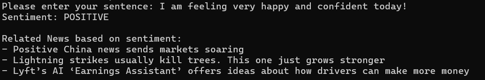
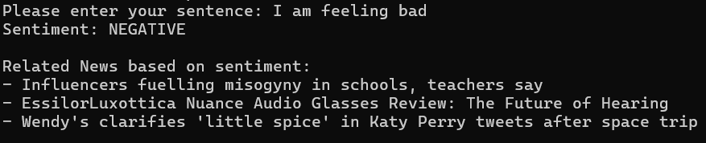
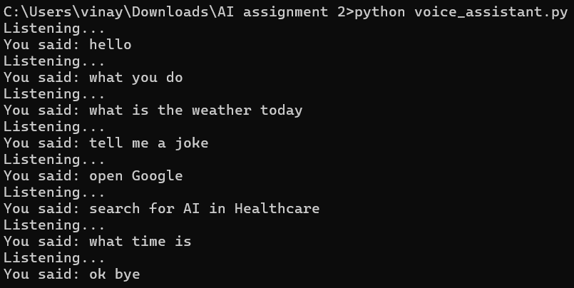
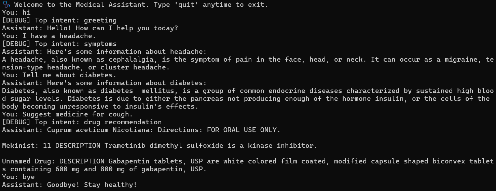
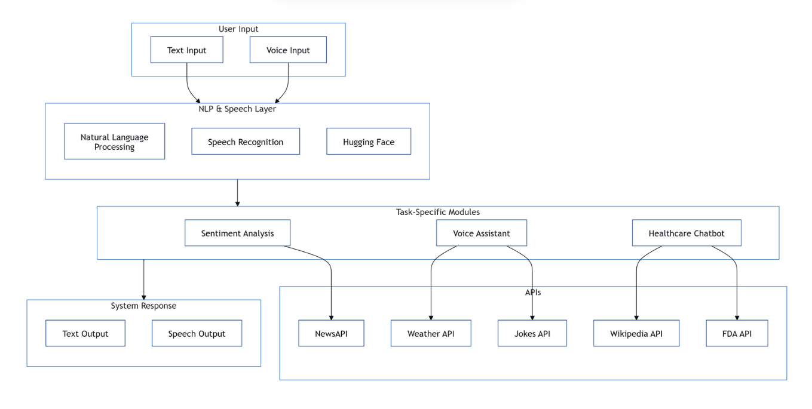

# 🧠 AI Assistant Project

This project contains three intelligent systems built using Python, NLP, and Speech technologies:

---

### 🔍 1. Sentiment Analysis
Identifies if a sentence expresses a positive or negative sentiment.  
Fetches relevant news articles based on sentiment.  
Uses Hugging Face Transformers and NewsAPI.

#### Sentiment Output

- **Positive Sentiment:**

  

- **Negative Sentiment:**

  

#### How It Works
- Analyzes user input using Hugging Face's `transformers` pipeline.
- Uses NewsAPI to fetch related articles based on the sentiment result.

---

### 🎙️ 2. Voice Assistant
Listens to voice commands.  
Responds with weather updates, jokes, or executes Google searches.  
Uses SpeechRecognition, pyttsx3, and OpenWeatherMap API.

#### Voice Assistant Output



📹 [Watch Demo Video](assets/voice_assistant_demo.mp4)

#### How It Works
- Uses `speech_recognition` to listen to voice commands.
- Responds with `pyttsx3` TTS engine.
- Supports actions like:
  - Telling the time
  - Fetching weather
  - Telling jokes
  - Google or YouTube search

---

### 🏥 3. Healthcare Chatbot
Answers queries about diseases and symptoms.  
Suggests drug recommendations using FDA Drug API.  
Uses Wikipedia and fuzzy matching.

#### Chatbot Output



#### How It Works
- Extracts medical-related intents using `transformers` zero-shot classifier.
- Provides basic disease info from Wikipedia.
- Suggests drugs using the open FDA Drug API.

---

### System Architecture
To visualize how the system works, here is the System Architecture Diagram:


This diagram shows the interaction between user input, NLP & Speech processing layers, and the task-specific modules for sentiment analysis, voice assistant, and healthcare chatbot.



## 🚀 How to Run

1. Install required packages:

```bash
pip install -r requirements.txt

Run each task:
bash
python sentiment_analysis.py
python voice_assistant.py
python healthcare_chatbot.py


🔑 API Keys
NewsAPI: https://newsapi.org

OpenWeatherMap: https://openweathermap.org/api

FDA Drug API: No API key needed
